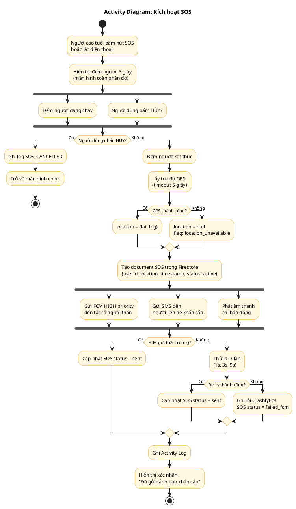
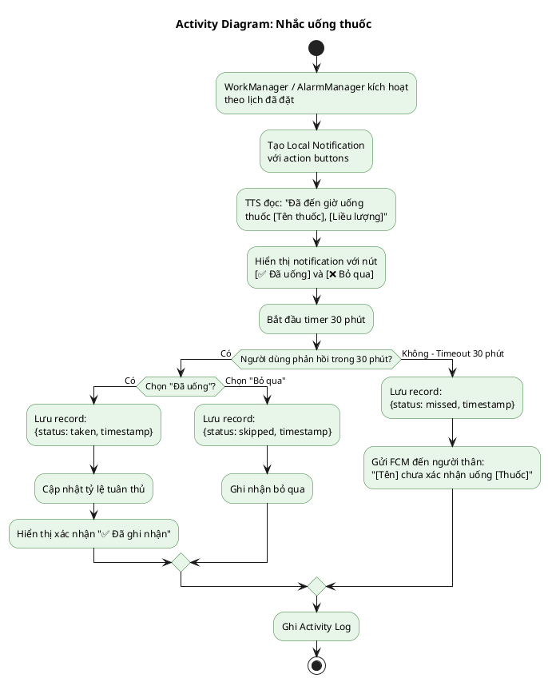
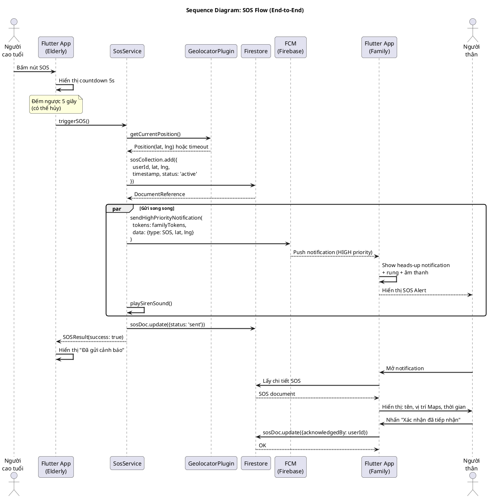
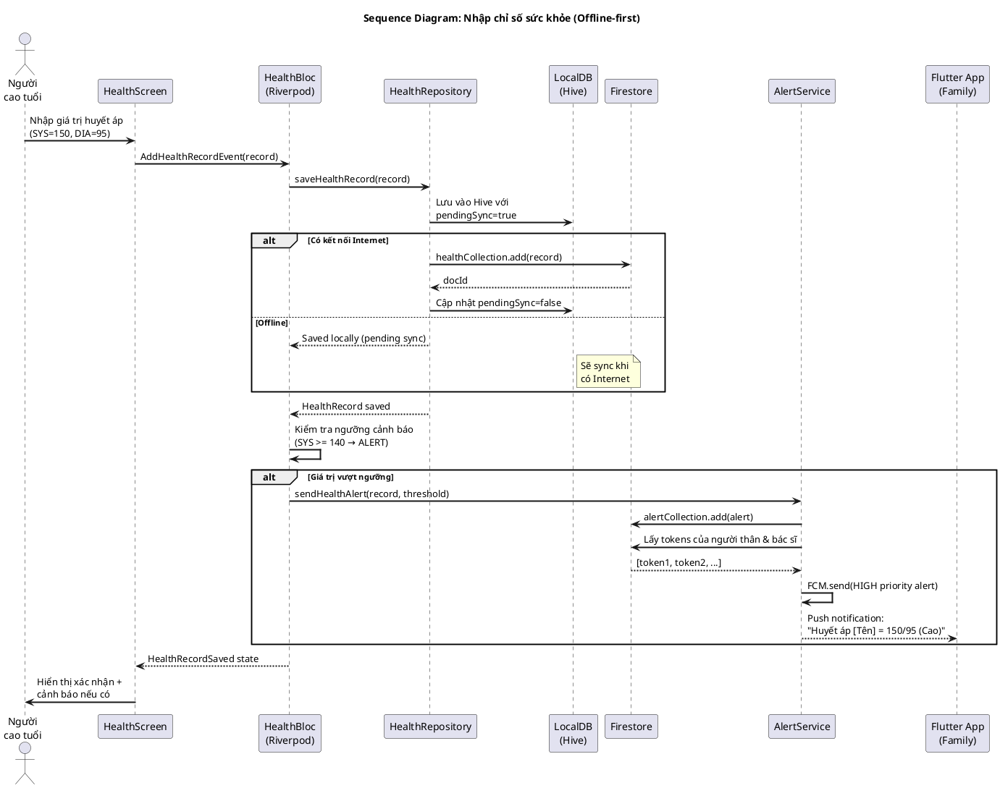
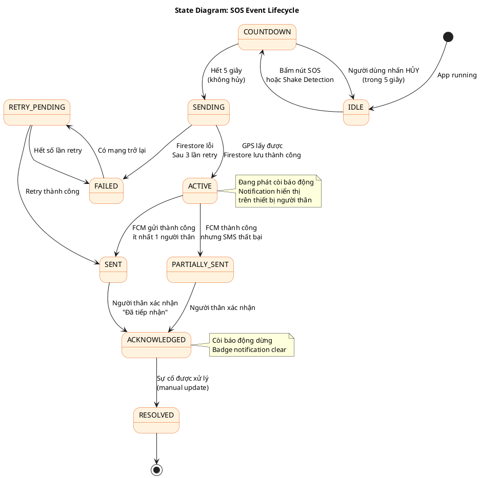
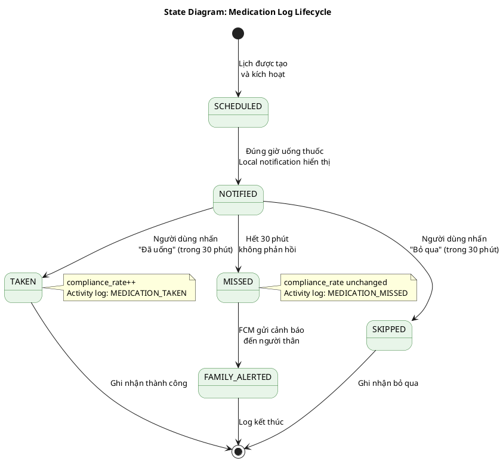
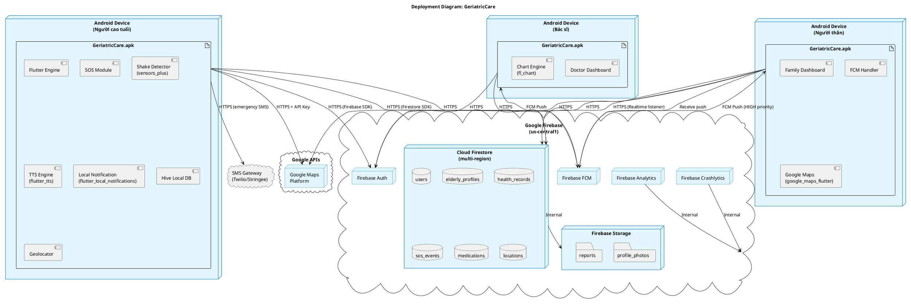

# Chương 10: UML Diagrams
## GeriatricCare – Sơ đồ UML 2.5 (PlantUML)

---

## 10.1 Use Case Diagram

```plantuml
@startuml UC_Overall
left to right direction
skinparam actorStyle awesome
skinparam packageStyle rectangle

actor "Người cao tuổi\n(Elderly)" as E
actor "Người thân\n(Family)" as F
actor "Bác sĩ\n(Doctor)" as D
actor "Quản trị viên\n(Admin)" as A
actor "Firebase" as FB <<external>>

rectangle "GeriatricCare System" {
  package "Authentication" {
    usecase "UC-AUTH-01\nĐăng ký" as UC1
    usecase "UC-AUTH-02\nĐăng nhập" as UC2
    usecase "UC-AUTH-03\nĐăng xuất" as UC3
    usecase "UC-AUTH-04\nQuên mật khẩu" as UC4
  }

  package "SOS & An toàn" {
    usecase "UC-SOS-01\nPanic Button" as SOS1
    usecase "UC-SOS-02\nShake Detection SOS" as SOS2
    usecase "UC-SOS-03\nNhận & Xử lý SOS" as SOS3
    usecase "UC-GPS\nXem vị trí GPS" as GPS
  }

  package "Sức khỏe" {
    usecase "UC-HLT-01\nNhập chỉ số sức khỏe" as HLT1
    usecase "UC-HLT-02\nXem biểu đồ" as HLT2
    usecase "UC-HLT-03\nCảnh báo bất thường" as HLT3
  }

  package "Thuốc" {
    usecase "UC-MED-01\nXác nhận uống thuốc" as MED1
    usecase "UC-MED-02\nTạo lịch uống thuốc" as MED2
    usecase "UC-MED-03\nCảnh báo bỏ lỡ thuốc" as MED3
  }

  package "Dashboard" {
    usecase "UC-FAM\nDashboard người thân" as FAM
    usecase "UC-DOC\nDashboard bác sĩ" as DOC
  }

  package "Admin" {
    usecase "UC-ADM-01\nQuản lý người dùng" as ADM1
    usecase "UC-ADM-02\nXem thống kê" as ADM2
  }

  usecase "UC-RPT\nXuất báo cáo PDF" as RPT
}

E --> UC1 ; E --> UC2 ; E --> UC3 ; E --> UC4
F --> UC1 ; F --> UC2 ; F --> UC3 ; F --> UC4
D --> UC1 ; D --> UC2 ; D --> UC3 ; D --> UC4

E --> SOS1 ; E --> SOS2 ; E --> HLT1 ; E --> MED1
F --> SOS3 ; F --> GPS ; F --> FAM ; F --> MED2 ; F --> RPT
D --> DOC ; D --> RPT

A --> ADM1 ; A --> ADM2

SOS1 ..> FB : <<include>> FCM
SOS2 ..> SOS1 : <<extend>>
HLT1 ..> HLT3 : <<extend>>
MED1 ..> MED3 : <<extend>>
@enduml
```

---

## 10.2 Activity Diagram – Luồng SOS



---

## 10.3 Activity Diagram – Nhắc uống thuốc



---

## 10.4 Sequence Diagram – Luồng SOS end-to-end



---

## 10.5 Sequence Diagram – Nhập chỉ số sức khỏe (offline-first)



---

## 10.6 Class Diagram – Domain Layer

```plantuml
@startuml CLS_DOMAIN
skinparam classBackgroundColor #F3E5F5
skinparam classBorderColor #7B1FA2
title Class Diagram: Domain Layer (Entities & Use Cases)

package "entities" {
  class UserEntity {
    +String id
    +String email
    +String fullName
    +UserRole role
    +DateTime createdAt
    +bool isActive
  }

  class ElderlyProfileEntity {
    +String id
    +String userId
    +String fullName
    +DateTime dateOfBirth
    +Gender gender
    +BloodType? bloodType
    +double? height
    +double? weight
    +List<String> medicalConditions
    +List<String> drugAllergies
    +EmergencyContact emergencyContact
    +String? address
    +String? photoUrl
  }

  class HealthRecordEntity {
    +String id
    +String elderlyId
    +HealthType type
    +Map<String, double> values
    +DateTime measuredAt
    +String? note
    +bool pendingSync
    +isAbnormal() bool
  }

  class MedicationScheduleEntity {
    +String id
    +String elderlyId
    +String medicationName
    +String dosage
    +int timesPerDay
    +List<TimeOfDay> scheduledTimes
    +DateTime startDate
    +DateTime? endDate
    +String? note
    +bool isActive
  }

  class MedicationLogEntity {
    +String id
    +String scheduleId
    +String elderlyId
    +DateTime scheduledTime
    +DateTime? respondedAt
    +MedicationStatus status
  }

  class SosEventEntity {
    +String id
    +String elderlyId
    +double? latitude
    +double? longitude
    +DateTime triggeredAt
    +SosTriggerType triggerType
    +SosStatus status
    +List<String> notifiedUserIds
    +String? cancelledBy
  }

  class LocationEntity {
    +String id
    +String elderlyId
    +double latitude
    +double longitude
    +double accuracy
    +DateTime timestamp
    +int? batteryLevel
  }

  class DoctorNoteEntity {
    +String id
    +String doctorId
    +String elderlyId
    +String content
    +DateTime createdAt
  }
}

package "enums" {
  enum UserRole { ELDERLY, FAMILY, DOCTOR, ADMIN }
  enum Gender { MALE, FEMALE, OTHER }
  enum BloodType { A, B, AB, O, A_NEG, B_NEG, AB_NEG, O_NEG }
  enum HealthType { BLOOD_PRESSURE, GLUCOSE, HEART_RATE, TEMPERATURE, SPO2, WEIGHT }
  enum MedicationStatus { TAKEN, SKIPPED, MISSED, PENDING }
  enum SosTriggerType { BUTTON, SHAKE }
  enum SosStatus { ACTIVE, SENT, CANCELLED, ACKNOWLEDGED, FAILED }
}

package "value_objects" {
  class EmergencyContact {
    +String name
    +String phoneNumber
    +String? relationship
  }

  class HealthThreshold {
    +HealthType type
    +double minValue
    +double maxValue
    +bool isExceeded(double value) bool
  }
}

UserEntity "1" --> "0..1" ElderlyProfileEntity
ElderlyProfileEntity "1" --> "*" HealthRecordEntity
ElderlyProfileEntity "1" --> "*" MedicationScheduleEntity
MedicationScheduleEntity "1" --> "*" MedicationLogEntity
ElderlyProfileEntity "1" --> "*" SosEventEntity
ElderlyProfileEntity "1" --> "*" LocationEntity
ElderlyProfileEntity "1" --> "*" DoctorNoteEntity
ElderlyProfileEntity "1" --> "1" EmergencyContact
@enduml
```

---

## 10.7 Class Diagram – Repository & Data Layer

```plantuml
@startuml CLS_REPOSITORY
skinparam classBackgroundColor #E3F2FD
skinparam classBorderColor #1565C0
title Class Diagram: Repository & Data Layer (Clean Architecture)

package "domain/repositories" {
  interface HealthRepository {
    +saveRecord(HealthRecordEntity) Future<Either<Failure, HealthRecordEntity>>
    +getRecords(String elderlyId, HealthType, DateRange) Stream<List<HealthRecordEntity>>
    +getLatestRecord(String elderlyId, HealthType) Future<Either<Failure, HealthRecordEntity?>>
    +syncPendingRecords() Future<Either<Failure, int>>
  }

  interface SosRepository {
    +triggerSOS(String elderlyId, Position?) Future<Either<Failure, SosEventEntity>>
    +cancelSOS(String sosId) Future<Either<Failure, Unit>>
    +getSosHistory(String elderlyId) Stream<List<SosEventEntity>>
    +acknowledgeSOS(String sosId, String userId) Future<Either<Failure, Unit>>
  }

  interface MedicationRepository {
    +createSchedule(MedicationScheduleEntity) Future<Either<Failure, String>>
    +updateSchedule(MedicationScheduleEntity) Future<Either<Failure, Unit>>
    +getSchedules(String elderlyId) Stream<List<MedicationScheduleEntity>>
    +logMedication(MedicationLogEntity) Future<Either<Failure, Unit>>
    +getComplianceRate(String elderlyId, DateRange) Future<Either<Failure, double>>
  }

  interface AuthRepository {
    +signUp(String email, String password, UserRole) Future<Either<Failure, UserEntity>>
    +signIn(String email, String password) Future<Either<Failure, UserEntity>>
    +signOut() Future<Either<Failure, Unit>>
    +getCurrentUser() UserEntity?
    +getUserRole(String uid) Future<Either<Failure, UserRole>>
  }
}

package "data/repositories_impl" {
  class HealthRepositoryImpl {
    -FirestoreHealthDatasource remoteDs
    -LocalHealthDatasource localDs
    -NetworkInfo networkInfo
  }

  class SosRepositoryImpl {
    -FirestoreSosDatasource remotDs
    -FcmDatasource fcmDs
    -GeolocatorDatasource geoDs
  }

  class MedicationRepositoryImpl {
    -FirestoreMedDatasource remoteDs
    -LocalNotificationDatasource notifDs
  }
}

package "data/datasources" {
  class FirestoreHealthDatasource {
    -FirebaseFirestore db
    +addRecord(HealthRecordModel) Future<void>
    +getRecordsStream(String, String, DateRange) Stream<List<HealthRecordModel>>
  }

  class LocalHealthDatasource {
    -Box<HealthRecordModel> hiveBox
    +saveRecord(HealthRecordModel) Future<void>
    +getPendingRecords() List<HealthRecordModel>
  }

  class FcmDatasource {
    -FirebaseMessaging fcm
    +sendNotification(String token, NotificationPayload) Future<void>
    +sendMulticast(List<String> tokens, NotificationPayload) Future<void>
  }
}

HealthRepositoryImpl ..|> HealthRepository
SosRepositoryImpl ..|> SosRepository
MedicationRepositoryImpl ..|> MedicationRepository
HealthRepositoryImpl --> FirestoreHealthDatasource
HealthRepositoryImpl --> LocalHealthDatasource
SosRepositoryImpl --> FcmDatasource
@enduml
```



---

## 10.8 State Diagram – Trạng thái SOS Event



---

## 10.9 State Diagram – Trạng thái Medication



---

## 10.10 Component Diagram

```plantuml
@startuml COMP
skinparam componentStyle rectangle
title Component Diagram: GeriatricCare Architecture

package "Flutter Mobile App" {
  package "Presentation Layer" {
    [AuthScreen]
    [ElderlyHomeScreen]
    [FamilyDashboardScreen]
    [DoctorDashboardScreen]
    [HealthTrackingScreen]
    [MedicationScreen]
    [MapScreen]
    [ReportScreen]
    [AdminScreen]
    [SettingsScreen]
  }

  package "Application Layer (BLoC/Riverpod)" {
    [AuthNotifier]
    [SosNotifier]
    [HealthNotifier]
    [MedicationNotifier]
    [LocationNotifier]
    [NotificationHandler]
  }

  package "Domain Layer" {
    [AuthUseCase]
    [TriggerSosUseCase]
    [SaveHealthRecordUseCase]
    [GetHealthHistoryUseCase]
    [CreateMedScheduleUseCase]
    [LogMedicationUseCase]
    [GetFamilyDashboardUseCase]
  }

  package "Data Layer" {
    [AuthRepositoryImpl]
    [HealthRepositoryImpl]
    [SosRepositoryImpl]
    [MedicationRepositoryImpl]
    [LocationRepositoryImpl]
  }

  package "Infrastructure" {
    [FirestoreDatasource]
    [FirebaseAuthDatasource]
    [FcmDatasource]
    [LocalHiveDatasource]
    [GeolocatorDatasource]
    [LocalNotificationDatasource]
    [TtsDatasource]
    [AccelerometerDatasource]
  }
}

package "Firebase (Backend)" {
  database "Cloud Firestore" as FS
  cloud "Firebase Auth" as AUTH
  cloud "Firebase Storage" as STORE
  cloud "Firebase FCM" as FCM
  cloud "Firebase Analytics" as ANA
  cloud "Firebase Crashlytics" as CRASH
}

package "External Services" {
  cloud "Google Maps API" as MAPS
  cloud "SMS Service\n(Twilio/Stringee)" as SMS
}

' Connections
FirestoreDatasource --> FS
FirebaseAuthDatasource --> AUTH
FcmDatasource --> FCM
GeolocatorDatasource --> MAPS
TtsDatasource --> [flutter_tts]
AccelerometerDatasource --> [sensors_plus]

AuthRepositoryImpl --> FirebaseAuthDatasource
AuthRepositoryImpl --> FirestoreDatasource
HealthRepositoryImpl --> FirestoreDatasource
HealthRepositoryImpl --> LocalHiveDatasource
SosRepositoryImpl --> FirestoreDatasource
SosRepositoryImpl --> FcmDatasource
SosRepositoryImpl --> SMS
MedicationRepositoryImpl --> FirestoreDatasource
MedicationRepositoryImpl --> LocalNotificationDatasource
MedicationRepositoryImpl --> TtsDatasource
LocationRepositoryImpl --> GeolocatorDatasource
LocationRepositoryImpl --> FirestoreDatasource
@enduml
```



---

## 10.11 Package Diagram – Cấu trúc dự án Flutter

```plantuml
@startuml PKG
skinparam packageStyle rectangle
skinparam packageBackgroundColor #F9FBE7
title Package Diagram: Flutter Project Structure

package "lib" {
  package "core" {
    package "core/constants" {
      [app_constants.dart]
      [route_constants.dart]
      [firebase_constants.dart]
    }
    package "core/errors" {
      [failures.dart]
      [exceptions.dart]
    }
    package "core/utils" {
      [either.dart]
      [validators.dart]
      [formatters.dart]
    }
    package "core/theme" {
      [app_theme.dart]
      [color_scheme.dart]
      [text_theme.dart]
    }
    package "core/di" {
      [injection_container.dart]
    }
    package "core/navigation" {
      [app_router.dart]
      [route_guards.dart]
    }
  }

  package "features" {
    package "features/auth" {
      package "data" { [auth_repository_impl] }
      package "domain" { [auth_use_cases] [auth_entities] }
      package "presentation" { [auth_screens] [auth_notifier] }
    }

    package "features/sos" {
      package "data" { [sos_repository_impl] [shake_detector] }
      package "domain" { [sos_use_cases] [sos_entities] }
      package "presentation" { [sos_screen] [sos_notifier] }
    }

    package "features/health" {
      package "data" { [health_repository_impl] [health_local_ds] }
      package "domain" { [health_use_cases] [health_entities] }
      package "presentation" { [health_screens] [health_notifier] }
    }

    package "features/medication" {
      package "data" { [med_repository_impl] }
      package "domain" { [med_use_cases] [med_entities] }
      package "presentation" { [med_screens] [med_notifier] }
    }

    package "features/dashboard" {
      package "family" { [family_dashboard] }
      package "doctor" { [doctor_dashboard] }
      package "elderly" { [elderly_home] }
    }

    package "features/location" {
      package "data" { [location_repository_impl] }
      package "domain" { [location_use_cases] }
      package "presentation" { [map_screen] }
    }

    package "features/report" {
      package "data" { [report_repository_impl] }
      package "domain" { [report_use_cases] }
      package "presentation" { [report_screen] }
    }
  }

  package "shared" {
    package "widgets" {
      [sos_button.dart]
      [health_chart.dart]
      [medication_card.dart]
      [loading_indicator.dart]
      [error_widget.dart]
    }
    package "extensions" {
      [datetime_ext.dart]
      [string_ext.dart]
    }
  }
}

"features/auth" ..> "core/di"
"features/sos" ..> "features/location"
"features/health" ..> "shared/widgets"
"features/medication" ..> "shared/widgets"
@enduml
```

---

## 10.12 Deployment Diagram



---

## 10.13 Tóm tắt các Diagram

| # | Diagram | Mục đích | Loại |
|---|---|---|---|
| 10.1 | Use Case Diagram | Tổng quan actor & chức năng | Structural |
| 10.2 | Activity Diagram – SOS | Luồng xử lý SOS chi tiết | Behavioral |
| 10.3 | Activity Diagram – Medication | Luồng nhắc uống thuốc | Behavioral |
| 10.4 | Sequence Diagram – SOS E2E | Tương tác giữa các component khi SOS | Behavioral |
| 10.5 | Sequence Diagram – Health | Luồng nhập sức khỏe offline-first | Behavioral |
| 10.6 | Class Diagram – Domain | Entities, enums, value objects | Structural |
| 10.7 | Class Diagram – Repository | Repository pattern + Data sources | Structural |
| 10.8 | State Diagram – SOS | Vòng đời SOS event | Behavioral |
| 10.9 | State Diagram – Medication | Vòng đời Medication log | Behavioral |
| 10.10 | Component Diagram | Kiến trúc component toàn hệ thống | Structural |
| 10.11 | Package Diagram | Cấu trúc thư mục Flutter project | Structural |
| 10.12 | Deployment Diagram | Triển khai vật lý / cloud | Structural |
