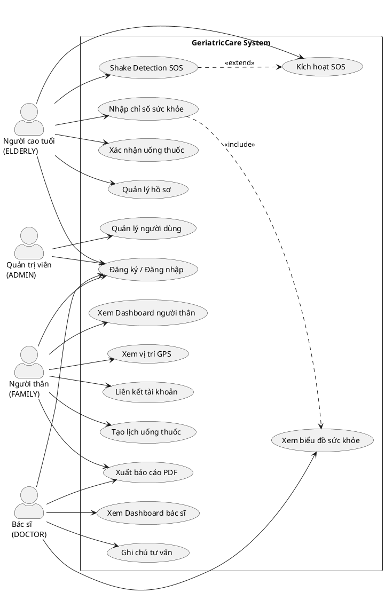
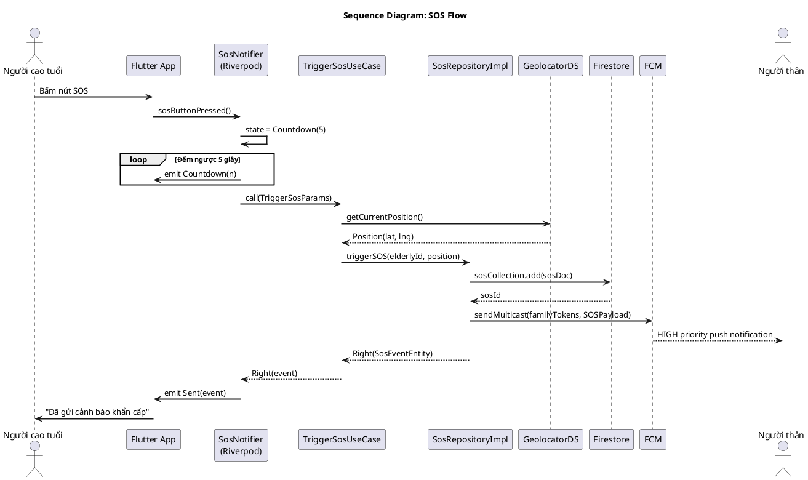
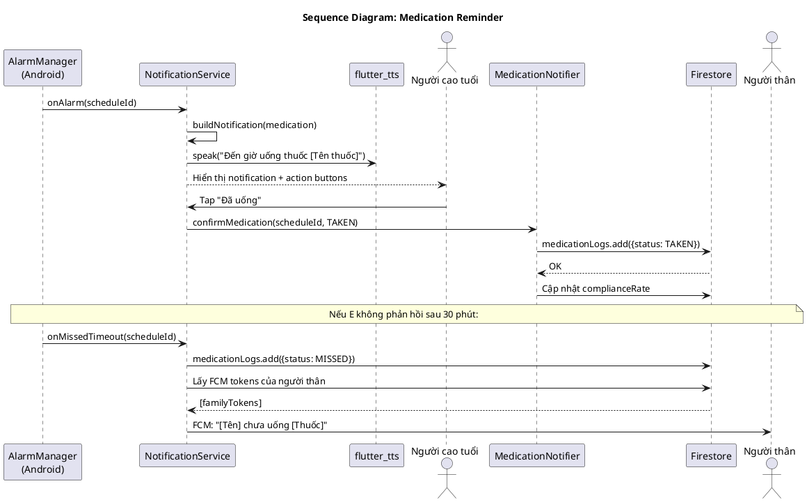

# CHƯƠNG 3: PHÂN TÍCH HỆ THỐNG

---

## 3.1 Khảo sát hiện trạng và xác định bài toán

### 3.1.1 Mô tả bài toán

Bài toán cần giải quyết: Xây dựng hệ thống phần mềm hỗ trợ giám sát và chăm sóc người cao tuổi sống độc cư, kết nối họ với người thân và bác sĩ, đảm bảo phản ứng kịp thời khi xảy ra tình huống khẩn cấp.

### 3.1.2 Các bên liên quan (Stakeholders)

| STT | Bên liên quan | Vai trò | Mối quan tâm chính |
|---|---|---|---|
| 1 | Người cao tuổi | Người dùng chính | An toàn, dễ sử dụng |
| 2 | Người thân (con, cháu) | Người dùng theo dõi | Thông tin sức khỏe, cảnh báo kịp thời |
| 3 | Bác sĩ / Điều dưỡng | Người dùng chuyên môn | Dữ liệu lâm sàng liên tục |
| 4 | Quản trị viên | Người vận hành | Quản lý hệ thống, thống kê |
| 5 | Firebase (Google) | Nhà cung cấp hạ tầng | SLA, chi phí |

### 3.1.3 Xác định tác nhân hệ thống

Dựa trên phân tích stakeholder, hệ thống có **4 tác nhân chính**:

| Tác nhân | Ký hiệu | Mô tả |
|---|---|---|
| Người cao tuổi | ELDERLY | Tương tác trực tiếp: SOS, nhập sức khỏe, xác nhận thuốc |
| Người thân | FAMILY | Theo dõi từ xa, cấu hình nhắc thuốc, nhận cảnh báo |
| Bác sĩ | DOCTOR | Xem lịch sử lâm sàng, ghi chú tư vấn |
| Quản trị viên | ADMIN | Quản lý hệ thống toàn diện |

---

## 3.2 Sơ đồ Use Case

### 3.2.1 Sơ đồ Use Case tổng thể

### 3.2.2 Danh sách Use Case

| ID | Tên Use Case | Tác nhân | Mức độ ưu tiên |
|---|---|---|---|
| UC-01 | Đăng ký tài khoản | Tất cả | Must Have |
| UC-02 | Đăng nhập hệ thống | Tất cả | Must Have |
| UC-03 | Quản lý hồ sơ người cao tuổi | ELDERLY, FAMILY | Must Have |
| UC-04 | Liên kết tài khoản | FAMILY, DOCTOR | Must Have |
| UC-05 | Kích hoạt SOS (Panic Button) | ELDERLY | Must Have |
| UC-06 | Kích hoạt SOS (Shake Detection) | ELDERLY | Must Have |
| UC-07 | Nhận và xử lý cảnh báo SOS | FAMILY | Must Have |
| UC-08 | Nhập chỉ số sức khỏe | ELDERLY, FAMILY | Must Have |
| UC-09 | Xem biểu đồ sức khỏe | FAMILY, DOCTOR | Must Have |
| UC-10 | Tạo lịch uống thuốc | FAMILY, DOCTOR | Must Have |
| UC-11 | Xác nhận uống thuốc | ELDERLY | Must Have |
| UC-12 | Xem Dashboard người thân | FAMILY | Must Have |
| UC-13 | Xem vị trí GPS trên bản đồ | FAMILY | Must Have |
| UC-14 | Xem Dashboard bác sĩ | DOCTOR | Must Have |
| UC-15 | Ghi chú tư vấn lâm sàng | DOCTOR | Must Have |
| UC-16 | Xuất báo cáo PDF/Excel | FAMILY, DOCTOR | Must Have |
| UC-17 | Quản lý người dùng (Admin) | ADMIN | Must Have |
| UC-18 | Xem thống kê hệ thống | ADMIN | Should Have |

---

## 3.3 Đặc tả Use Case chi tiết

### 3.3.1 UC-05: Kích hoạt SOS (Panic Button)

| Thuộc tính | Nội dung |
|---|---|
| **Use Case ID** | UC-05 |
| **Tên** | Kích hoạt cảnh báo SOS bằng nút bấm |
| **Tác nhân chính** | Người cao tuổi (ELDERLY) |
| **Tác nhân phụ** | Firebase FCM, Dịch vụ SMS |
| **Điều kiện tiên quyết** | Người dùng đã đăng nhập; ứng dụng đang chạy; có ít nhất 1 người thân liên kết |
| **Hậu điều kiện thành công** | SOS được ghi nhận; thông báo gửi đến tất cả người thân; vị trí GPS được chia sẻ |
| **Hậu điều kiện thất bại** | SOS lưu offline; âm thanh báo động phát; retry khi có mạng |

**Luồng chính:**

| Bước | Tác nhân | Hành động |
|---|---|---|
| 1 | Người cao tuổi | Nhấn nút SOS đỏ trên màn hình chính |
| 2 | Hệ thống | Hiển thị màn hình đếm ngược 5 giây (nền đỏ toàn màn hình) |
| 3 | Hệ thống | Hiển thị nút HỦY rõ ràng |
| 4 | Người cao tuổi | Không nhấn HỦY |
| 5 | Hệ thống | Gọi Geolocator lấy tọa độ GPS |
| 6 | Hệ thống | Tạo bản ghi SOS trong Firestore (status: ACTIVE) |
| 7 | Hệ thống | Gửi FCM HIGH priority đến tất cả người thân liên kết |
| 8 | Hệ thống | Gửi SMS đến người liên hệ khẩn cấp |
| 9 | Hệ thống | Phát âm thanh còi báo động |
| 10 | Hệ thống | Cập nhật SOS status = SENT; ghi Activity Log |
| 11 | Hệ thống | Hiển thị màn hình xác nhận "Đã gửi cảnh báo" |

**Luồng thay thế:**

*A1 – Người dùng hủy trong đếm ngược:*
- Bước 3a: Người dùng nhấn HỦY → Hủy SOS, ghi log CANCELLED, trở về màn hình chính.

*A2 – GPS không khả dụng:*
- Bước 5a: Timeout GPS sau 5 giây → Tiếp tục gửi SOS không có tọa độ; thêm flag `location_unavailable: true`.

**Luồng ngoại lệ:**

*E1 – Không có Internet:* Lưu SOS vào queue local; phát âm báo động; hiển thị "Đang gửi..."; retry tự động khi có mạng.

*E2 – FCM thất bại:* Retry 3 lần (1s → 3s → 9s); nếu vẫn thất bại → gửi SMS dự phòng; ghi lỗi Crashlytics.

---

### 3.3.2 UC-10: Tạo lịch uống thuốc

| Thuộc tính | Nội dung |
|---|---|
| **Use Case ID** | UC-10 |
| **Tên** | Tạo lịch nhắc uống thuốc cho người cao tuổi |
| **Tác nhân chính** | Người thân (FAMILY) hoặc Bác sĩ (DOCTOR) |
| **Điều kiện tiên quyết** | Đã đăng nhập; đã liên kết với người cao tuổi |
| **Hậu điều kiện** | Lịch thuốc được lưu; local notification được lên lịch |

**Luồng chính:**

| Bước | Tác nhân | Hành động |
|---|---|---|
| 1 | Người thân | Vào mục Thuốc → Thêm thuốc mới |
| 2 | Hệ thống | Hiển thị form tạo lịch thuốc |
| 3 | Người thân | Điền: Tên thuốc, Liều lượng, Số lần/ngày, Thời gian |
| 4 | Người thân | Đặt ngày bắt đầu và kết thúc (tùy chọn) |
| 5 | Người thân | Nhấn Lưu |
| 6 | Hệ thống | Validate dữ liệu |
| 7 | Hệ thống | Lưu MedicationSchedule vào Firestore |
| 8 | Hệ thống | Lên lịch Local Notification qua AlarmManager |
| 9 | Hệ thống | Hiển thị xác nhận và preview lịch nhắc |

---

### 3.3.3 UC-08: Nhập chỉ số sức khỏe

| Thuộc tính | Nội dung |
|---|---|
| **Use Case ID** | UC-08 |
| **Tên** | Nhập và lưu chỉ số sức khỏe |
| **Tác nhân chính** | Người cao tuổi (ELDERLY) |
| **Điều kiện tiên quyết** | Đã đăng nhập; có hồ sơ người cao tuổi |

**Luồng chính:**

| Bước | Tác nhân | Hành động |
|---|---|---|
| 1 | Người cao tuổi | Chọn loại chỉ số (Huyết áp, Đường huyết...) |
| 2 | Hệ thống | Hiển thị form nhập với bàn phím số lớn |
| 3 | Người cao tuổi | Nhập giá trị đo |
| 4 | Hệ thống | Tự động điền ngày giờ hiện tại |
| 5 | Người cao tuổi | Nhấn Lưu |
| 6 | Hệ thống | Lưu offline-first vào Hive; đồng bộ Firestore nếu có mạng |
| 7 | Hệ thống | Kiểm tra ngưỡng cảnh báo |
| 8 | Hệ thống | Nếu bất thường → gửi FCM Health Alert đến người thân và bác sĩ |
| 9 | Hệ thống | Cập nhật biểu đồ; hiển thị nhận xét (Bình thường / Cảnh báo) |

---

## 3.4 Yêu cầu chức năng

### 3.4.1 Tổng hợp yêu cầu theo module

| Module | Số yêu cầu Must Have | Số yêu cầu Should Have | Tổng |
|---|---|---|---|
| Authentication & RBAC | 7 | 1 | 8 |
| Quản lý hồ sơ | 6 | 2 | 8 |
| SOS & Cảnh báo khẩn cấp | 8 | 3 | 11 |
| Theo dõi sức khỏe | 8 | 3 | 11 |
| Nhắc uống thuốc | 7 | 3 | 10 |
| Dashboard người thân | 7 | 3 | 10 |
| Dashboard bác sĩ | 5 | 1 | 6 |
| GPS & Bản đồ | 3 | 2 | 5 |
| Thông báo | 3 | 2 | 5 |
| Báo cáo | 3 | 2 | 5 |
| **Tổng** | **57** | **22** | **79** |

### 3.4.2 Phân loại theo MoSCoW

| Loại | Mô tả | Số lượng |
|---|---|---|
| **Must Have** | Bắt buộc có trong phiên bản 1.0 | 57 |
| **Should Have** | Nên có, ưu tiên cao sau Must Have | 22 |
| **Could Have** | Có thể có nếu còn thời gian | 8 |
| **Won't Have** | Không làm trong phiên bản 1.0 | 5 |

### 3.4.3 Các chỉ số sức khỏe và ngưỡng cảnh báo

| Chỉ số | Đơn vị | Ngưỡng bình thường | Ngưỡng cảnh báo | Mức độ |
|---|---|---|---|---|
| Huyết áp tâm thu (SYS) | mmHg | 90–139 | ≥ 140 hoặc < 90 | 🔴 Cao |
| Huyết áp tâm trương (DIA) | mmHg | 60–89 | ≥ 90 hoặc < 60 | 🔴 Cao |
| Nhịp tim | bpm | 60–100 | > 100 hoặc < 60 | 🟠 Trung bình |
| Đường huyết (lúc đói) | mmol/L | 3.9–6.9 | < 3.9 hoặc > 7.0 | 🔴 Cao |
| Nhiệt độ cơ thể | °C | 36.1–37.2 | < 35.5 hoặc > 38.0 | 🟠 Trung bình |
| SpO2 | % | 95–100 | < 93 | 🔴 Khẩn cấp |
| BMI | kg/m² | 18.5–29.9 | < 18.5 hoặc ≥ 30 | 🟡 Thấp |

---

## 3.5 Yêu cầu phi chức năng

### 3.5.1 Hiệu năng

| ID | Chỉ tiêu | Mục tiêu | Chấp nhận tối đa |
|---|---|---|---|
| NFR-P01 | Khởi động ứng dụng (cold start) | < 3 giây | < 5 giây |
| NFR-P02 | Gửi SOS (từ xác nhận → FCM đến người thân) | < 3 giây | < 5 giây |
| NFR-P03 | Tải danh sách màn hình | < 1 giây | < 2 giây |
| NFR-P04 | Render biểu đồ sức khỏe | < 2 giây | < 4 giây |
| NFR-P05 | Xuất báo cáo PDF | < 5 giây | < 10 giây |
| NFR-P06 | RAM tối đa sử dụng | < 150 MB | < 200 MB |
| NFR-P07 | Tiêu thụ pin (background, GPS off) | < 2%/giờ | < 5%/giờ |

### 3.5.2 Bảo mật

| ID | Yêu cầu | Tiêu chuẩn |
|---|---|---|
| NFR-S01 | Xác thực 2 yếu tố | Firebase Auth + Email OTP |
| NFR-S02 | Mã hóa dữ liệu truyền | TLS 1.3 |
| NFR-S03 | Mã hóa dữ liệu tại chỗ | AES-256 (Hive encrypted) |
| NFR-S04 | Khóa tài khoản brute force | 5 lần sai → khóa 15 phút |
| NFR-S05 | Phân quyền truy cập | RBAC 4 vai trò |
| NFR-S06 | Audit Log | Ghi mọi hành động nhạy cảm |
| NFR-S07 | OWASP Mobile Top 10 | Tuân thủ đầy đủ |

### 3.5.3 Khả năng tiếp cận (Accessibility)

| ID | Yêu cầu | Tiêu chuẩn |
|---|---|---|
| NFR-A01 | Font body tối thiểu | ≥ 18sp |
| NFR-A02 | Kích thước nút tối thiểu | 48×48 dp (nút SOS: 80dp) |
| NFR-A03 | Contrast ratio | ≥ 4.5:1 (WCAG AA) |
| NFR-A04 | Hỗ trợ TalkBack (screen reader) | Semantic labels đầy đủ |
| NFR-A05 | Hỗ trợ giọng nói tiếng Việt | TTS nhắc thuốc |
| NFR-A06 | Tùy chỉnh cỡ chữ | 4 mức: Nhỏ/Vừa/Lớn/Rất lớn |

### 3.5.4 Độ sẵn sàng và tin cậy

| ID | Yêu cầu | Mục tiêu |
|---|---|---|
| NFR-R01 | Uptime hệ thống | ≥ 99.9% |
| NFR-R02 | Uptime tính năng SOS | ≥ 99.99% |
| NFR-R03 | Crash rate | < 0.1% sessions |
| NFR-R04 | Hoạt động offline | Nhập sức khỏe, nhắc thuốc |
| NFR-R05 | Recovery Time Objective | < 1 giờ |

### 3.5.5 Tương thích

| ID | Yêu cầu |
|---|---|
| NFR-C01 | Android 8.0+ (API 26+) |
| NFR-C02 | Màn hình 4.7"–7" |
| NFR-C03 | RAM tối thiểu 2 GB |
| NFR-C04 | Hỗ trợ Dark Mode |
| NFR-C05 | Ngôn ngữ: Tiếng Việt (chính), Tiếng Anh (phụ) |

---

## 3.6 Sơ đồ tuần tự (Sequence Diagram) các luồng quan trọng

### 3.6.1 Luồng SOS End-to-End

### 3.6.2 Luồng nhắc uống thuốc

---

*Kết thúc Chương 3*
