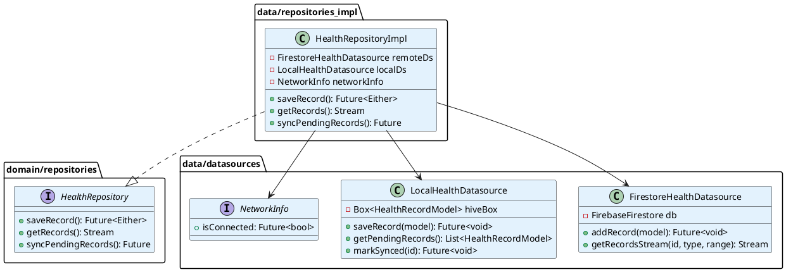
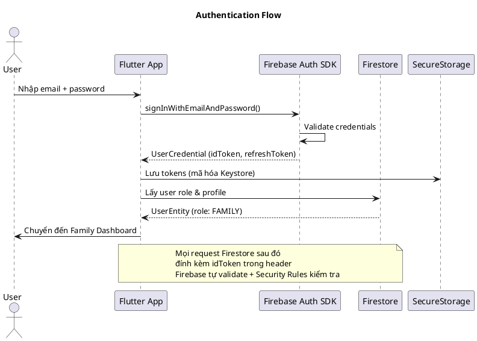
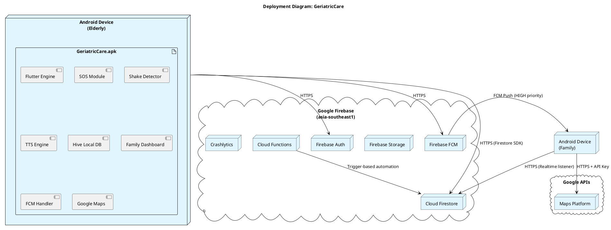

# CHƯƠNG 4: THIẾT KẾ HỆ THỐNG

---

## 4.1 Kiến trúc tổng thể hệ thống

### 4.1.1 Kiến trúc tổng quan

GeriatricCare áp dụng kiến trúc **Client–BaaS (Backend-as-a-Service)** kết hợp **Clean Architecture** trong tầng client:

```
┌─────────────────────────────────────────────────────────┐
│              ANDROID DEVICE (Flutter App)                │
│                                                         │
│  ┌───────────┐  ┌───────────┐  ┌──────────────────┐    │
│  │ ELDERLY   │  │  FAMILY   │  │  DOCTOR / ADMIN  │    │
│  │   APP     │  │   APP     │  │      APP         │    │
│  └─────┬─────┘  └─────┬─────┘  └────────┬─────────┘    │
│        │              │                 │               │
│  ┌─────▼──────────────▼─────────────────▼──────────┐    │
│  │           CLEAN ARCHITECTURE LAYERS             │    │
│  │  Presentation → Application → Domain → Data    │    │
│  └──────────────────────┬──────────────────────────┘    │
└─────────────────────────┼───────────────────────────────┘
                          │ HTTPS / Firebase SDK
┌─────────────────────────▼───────────────────────────────┐
│                  FIREBASE PLATFORM                       │
│  ┌──────────┐ ┌──────────┐ ┌──────────┐ ┌───────────┐  │
│  │  Auth    │ │Firestore │ │ Storage  │ │   FCM     │  │
│  └──────────┘ └──────────┘ └──────────┘ └───────────┘  │
│  ┌──────────┐ ┌──────────┐ ┌──────────┐ ┌───────────┐  │
│  │Analytics │ │Crashlytics│ │ Remote  │ │  Cloud    │  │
│  │          │ │           │ │ Config  │ │ Functions │  │
│  └──────────┘ └──────────┘ └──────────┘ └───────────┘  │
└─────────────────────────────────────────────────────────┘
                          │
┌─────────────────────────▼───────────────────────────────┐
│               EXTERNAL SERVICES                          │
│      Google Maps API          SMS Gateway                │
└─────────────────────────────────────────────────────────┘
```

### 4.1.2 Các lớp kiến trúc Clean Architecture

**Presentation Layer** – Tầng giao diện:
- Screens: Các màn hình Flutter (Widget tree).
- State Notifiers: Lớp quản lý trạng thái UI bằng Riverpod `StateNotifier`.
- Navigation: GoRouter xử lý routing và deep links.

**Application Layer** – Tầng ứng dụng:
- Use Cases: Mỗi hành động nghiệp vụ là một Use Case độc lập (ví dụ: `TriggerSosUseCase`, `SaveHealthRecordUseCase`).
- DTOs và Mappers: Chuyển đổi giữa Entity (domain) và Model (data).

**Domain Layer** – Tầng nghiệp vụ (hạt nhân):
- Entities: Đối tượng nghiệp vụ thuần túy (`UserEntity`, `SosEventEntity`, `HealthRecordEntity`).
- Repository Interfaces: Định nghĩa contract truy cập dữ liệu.
- Business Rules: Logic kiểm tra ngưỡng sức khỏe, tính tỷ lệ tuân thủ thuốc.

**Data Layer** – Tầng dữ liệu:
- Repository Implementations: Triển khai cụ thể các interface từ Domain.
- Remote DataSource: Giao tiếp với Firebase Firestore và FCM.
- Local DataSource: Lưu trữ offline qua Hive database.

**Infrastructure Layer** – Tầng hạ tầng:
- Wrapper các SDK bên thứ ba: Firebase, Geolocator, flutter_tts, sensors_plus.

---

## 4.2 Thiết kế lớp (Class Diagram)

### 4.2.1 Sơ đồ lớp Domain Layer

```plantuml
@startuml
skinparam classBackgroundColor #F3E5F5

package "domain/entities" {
  class UserEntity {
    +String id
    +String email
    +String fullName
    +UserRole role
    +bool isActive
    +DateTime createdAt
  }

  class ElderlyProfileEntity {
    +String id
    +String userId
    +String fullName
    +DateTime dateOfBirth
    +Gender gender
    +BloodType? bloodType
    +List<String> medicalConditions
    +List<String> drugAllergies
    +EmergencyContact emergencyContact
    +String? address
  }

  class HealthRecordEntity {
    +String id
    +String elderlyId
    +HealthType type
    +Map<String, double> values
    +DateTime measuredAt
    +bool isAbnormal
    +bool pendingSync
    +String? note
  }

  class SosEventEntity {
    +String id
    +String elderlyId
    +SosTriggerType triggerType
    +double? latitude
    +double? longitude
    +SosStatus status
    +DateTime triggeredAt
    +List<String> notifiedUserIds
  }

  class MedicationScheduleEntity {
    +String id
    +String elderlyId
    +String medicationName
    +String dosage
    +int timesPerDay
    +List<TimeOfDay> scheduledTimes
    +DateTime startDate
    +DateTime? endDate
    +bool isActive
  }

  class MedicationLogEntity {
    +String id
    +String scheduleId
    +String elderlyId
    +DateTime scheduledTime
    +MedicationStatus status
    +DateTime? respondedAt
  }
}

package "domain/enums" {
  enum UserRole { ELDERLY, FAMILY, DOCTOR, ADMIN }
  enum HealthType { BLOOD_PRESSURE, GLUCOSE, HEART_RATE, TEMPERATURE, SPO2, WEIGHT }
  enum SosStatus { ACTIVE, SENT, CANCELLED, ACKNOWLEDGED, FAILED }
  enum MedicationStatus { PENDING, TAKEN, SKIPPED, MISSED }
}

package "domain/repositories" {
  interface HealthRepository {
    +saveRecord(HealthRecordEntity): Future<Either<Failure, HealthRecordEntity>>
    +getRecords(elderlyId, type, range): Stream<List<HealthRecordEntity>>
    +getLatestRecord(elderlyId, type): Future<Either<Failure, HealthRecordEntity?>>
    +syncPendingRecords(): Future<Either<Failure, int>>
  }

  interface SosRepository {
    +triggerSOS(elderlyId, position): Future<Either<Failure, SosEventEntity>>
    +cancelSOS(sosId): Future<Either<Failure, Unit>>
    +getSosHistory(elderlyId): Stream<List<SosEventEntity>>
    +acknowledgeSOS(sosId, userId): Future<Either<Failure, Unit>>
  }

  interface MedicationRepository {
    +createSchedule(MedicationScheduleEntity): Future<Either<Failure, String>>
    +getSchedules(elderlyId): Stream<List<MedicationScheduleEntity>>
    +logMedication(MedicationLogEntity): Future<Either<Failure, Unit>>
    +getComplianceRate(elderlyId, range): Future<Either<Failure, double>>
  }
}

UserEntity "1" --> "0..1" ElderlyProfileEntity
ElderlyProfileEntity "1" --> "*" HealthRecordEntity
ElderlyProfileEntity "1" --> "*" SosEventEntity
ElderlyProfileEntity "1" --> "*" MedicationScheduleEntity
MedicationScheduleEntity "1" --> "*" MedicationLogEntity
@enduml
```

### 4.2.2 Sơ đồ lớp Repository Pattern



### 4.2.3 Sơ đồ lớp Presentation Layer (Riverpod)

```plantuml
@startuml
skinparam classBackgroundColor #E8F5E9

package "features/sos/presentation" {
  class SosNotifier {
    -TriggerSosUseCase triggerSos
    -CancelSosUseCase cancelSos
    +sosButtonPressed(): void
    +cancelCountdown(): void
    +acknowledgeReceived(sosId): void
  }

  class SosState <<sealed>> {
  }
  class SosIdle extends SosState {}
  class SosCountdown extends SosState { int seconds }
  class SosSending extends SosState {}
  class SosSent extends SosState { SosEventEntity event }
  class SosCancelled extends SosState {}
  class SosError extends SosState { String message }
}

package "features/sos/domain" {
  class TriggerSosUseCase {
    -SosRepository repository
    +call(params): Future<Either>
  }
  class CancelSosUseCase {
    -SosRepository repository
    +call(params): Future<Either>
  }
}

SosNotifier --> TriggerSosUseCase
SosNotifier --> CancelSosUseCase
SosNotifier --> SosState
@enduml
```

---

## 4.3 Thiết kế cơ sở dữ liệu Firestore

### 4.3.1 Cấu trúc Collection

```
firestore/
├── users/{userId}
├── elderly_profiles/{elderlyId}
│   ├── health_records/{recordId}
│   ├── sos_events/{sosId}
│   ├── medication_schedules/{scheduleId}
│   │   └── medication_logs/{logId}
│   ├── location_history/{locationId}
│   └── activity_logs/{logId}
├── family_links/{linkId}
├── doctor_links/{linkId}
│   └── doctor_notes/{noteId}
├── health_thresholds/{elderlyId|"default"}
└── notification_settings/{userId}
```

### 4.3.2 Thiết kế collection `users`

| Field | Kiểu dữ liệu | Bắt buộc | Mô tả |
|---|---|---|---|
| `id` | string | ✅ | Firebase Auth UID |
| `email` | string | ✅ | Email đăng nhập (unique) |
| `fullName` | string | ✅ | Họ tên đầy đủ |
| `role` | enum | ✅ | ELDERLY / FAMILY / DOCTOR / ADMIN |
| `phoneNumber` | string | ❌ | Số điện thoại |
| `photoUrl` | string | ❌ | URL Firebase Storage |
| `fcmTokens` | array\<string\> | ❌ | Token FCM đa thiết bị |
| `isActive` | boolean | ✅ | Trạng thái tài khoản |
| `isEmailVerified` | boolean | ✅ | Xác thực email |
| `createdAt` | timestamp | ✅ | Thời điểm tạo |
| `updatedAt` | timestamp | ✅ | Lần cập nhật cuối |
| `lastLoginAt` | timestamp | ❌ | Lần đăng nhập gần nhất |

### 4.3.3 Thiết kế collection `elderly_profiles`

| Field | Kiểu dữ liệu | Bắt buộc | Mô tả |
|---|---|---|---|
| `id` | string | ✅ | Auto-generated ID |
| `userId` | string | ✅ | FK → users.id |
| `fullName` | string | ✅ | Họ tên |
| `dateOfBirth` | timestamp | ✅ | Ngày sinh |
| `gender` | enum | ✅ | MALE / FEMALE / OTHER |
| `bloodType` | enum | ❌ | A / B / AB / O |
| `height` | number | ❌ | Chiều cao (cm) |
| `weight` | number | ❌ | Cân nặng (kg) |
| `medicalConditions` | array\<string\> | ❌ | Danh sách bệnh nền |
| `drugAllergies` | array\<string\> | ❌ | Dị ứng thuốc |
| `emergencyContact` | map | ✅ | {name, phone, relationship} |
| `address` | string | ❌ | Địa chỉ thường trú |
| `linkCode` | string | ❌ | Mã liên kết 6 chữ số |
| `linkCodeExpiresAt` | timestamp | ❌ | Hết hạn sau 24 giờ |

### 4.3.4 Thiết kế subcollection `health_records`

| Field | Kiểu dữ liệu | Bắt buộc | Mô tả |
|---|---|---|---|
| `id` | string | ✅ | Auto ID |
| `elderlyId` | string | ✅ | Denormalized parent ID |
| `type` | enum | ✅ | BLOOD_PRESSURE / GLUCOSE / HEART_RATE / TEMPERATURE / SPO2 / WEIGHT |
| `values` | map | ✅ | Giá trị theo type (sys, dia, pulse... ) |
| `measuredAt` | timestamp | ✅ | Thời điểm đo (thực tế) |
| `isAbnormal` | boolean | ✅ | Tính toán server-side |
| `pendingSync` | boolean | ✅ | True khi lưu offline |
| `note` | string | ❌ | Ghi chú |
| `createdBy` | string | ✅ | userId người nhập |

**Schema values theo type:**

| HealthType | Keys trong `values` |
|---|---|
| BLOOD_PRESSURE | sys (mmHg), dia (mmHg), pulse (bpm) |
| GLUCOSE | value (mmol/L), measurementType (fasting/postprandial) |
| HEART_RATE | bpm |
| TEMPERATURE | celsius |
| SPO2 | percent |
| WEIGHT | kg |

### 4.3.5 Thiết kế subcollection `sos_events`

| Field | Kiểu dữ liệu | Bắt buộc | Mô tả |
|---|---|---|---|
| `id` | string | ✅ | Auto ID |
| `elderlyId` | string | ✅ | |
| `triggerType` | enum | ✅ | BUTTON / SHAKE |
| `latitude` | number | ❌ | GPS lat |
| `longitude` | number | ❌ | GPS lng |
| `locationAccuracy` | number | ❌ | Độ chính xác (m) |
| `status` | enum | ✅ | ACTIVE / SENT / CANCELLED / ACKNOWLEDGED / FAILED |
| `notifiedUserIds` | array\<string\> | ❌ | Danh sách đã nhận |
| `acknowledgedBy` | string | ❌ | userId xác nhận |
| `acknowledgedAt` | timestamp | ❌ | |
| `triggeredAt` | timestamp | ✅ | Thời điểm kích hoạt |
| `sentAt` | timestamp | ❌ | Thời điểm gửi thành công |

### 4.3.6 Sơ đồ quan hệ tổng thể

```
users (1) ─────────── (1) elderly_profiles
                              │
              ┌───────────────┼────────────────┐
              │               │                │
      health_records     sos_events   medication_schedules
              │                                │
    (per type)                        medication_logs

users (*) ──── family_links ──── (*) elderly_profiles
users (*) ──── doctor_links ──── (*) elderly_profiles
                  │
             doctor_notes
```

### 4.3.7 Firestore Security Rules (tóm tắt)

```javascript
rules_version = '2';
service cloud.firestore {
  match /databases/{database}/documents {

    // Users chỉ đọc/ghi thông tin của mình
    match /users/{userId} {
      allow read: if isOwner(userId) || isAdmin();
      allow write: if isOwner(userId) || isAdmin();
    }

    // Elderly profiles: chỉ bản thân, người thân, bác sĩ liên kết
    match /elderly_profiles/{elderlyId} {
      allow read: if canReadElderlyData(elderlyId);
      allow write: if canWriteElderlyData(elderlyId);

      // Health records: immutable sau khi tạo
      match /health_records/{recordId} {
        allow read: if canReadElderlyData(elderlyId);
        allow create: if canWriteElderlyData(elderlyId);
        allow update, delete: if false; // Bất biến
      }

      // SOS: người cao tuổi tạo, người thân xác nhận
      match /sos_events/{sosId} {
        allow read: if canReadElderlyData(elderlyId);
        allow create: if isElderlyOwner(elderlyId);
        allow update: if isFamilyOfElderly(elderlyId) || isAdmin();
      }
    }

    // Notification: SOS không thể tắt
    match /notification_settings/{userId} {
      allow write: if isOwner(userId)
        && request.resource.data.sosAlerts == true;
    }
  }
}
```

---

## 4.4 Thiết kế giao diện người dùng

### 4.4.1 Nguyên tắc thiết kế Senior-first UX

Giao diện GeriatricCare được thiết kế theo nguyên tắc **Senior-first UX**, ưu tiên tối đa trải nghiệm của người cao tuổi:

| Nguyên tắc | Yêu cầu kỹ thuật | Lý do |
|---|---|---|
| Font lớn | Body ≥ 18sp, tiêu đề ≥ 22sp | Thị lực người cao tuổi kém |
| Nút to | Tối thiểu 48×48 dp (SOS: 80 dp) | Vận động tinh kém, ngón tay run |
| Màu tương phản | Contrast ratio ≥ 4.5:1 (WCAG AA) | Phân biệt màu kém |
| Tối giản | Tối đa 3–4 hành động chính/màn hình | Giảm nhận thức thông tin |
| Feedback | Haptic + visual + âm thanh | Xác nhận hành động |
| Nhất quán | Vị trí nút SOS không thay đổi | Tạo thói quen phản xạ |

### 4.4.2 Bảng màu sắc (Color Scheme)

| Token | Hex | Dùng cho |
|---|---|---|
| Primary | `#1565C0` | Nút chính, thanh navigation |
| SOS Red | `#D32F2F` | Nút SOS, màn hình cảnh báo |
| Safe Green | `#2E7D32` | Trạng thái bình thường |
| Warning Amber | `#FF8F00` | Cảnh báo nhẹ |
| Surface | `#F8F9FA` | Nền màn hình |
| On Surface | `#1A1A1A` | Văn bản chính |

### 4.4.3 Wireframe màn hình chính (Elderly Home)

```
┌─────────────────────────────────────┐
│  ☰  GeriatricCare         🔔   ⚙️  │  ← AppBar (64dp)
├─────────────────────────────────────┤
│  Xin chào, bà Nguyễn! 👋           │
│  Thứ Ba, 22 tháng 7 năm 2026       │
├─────────────────────────────────────┤
│  ┌─────────────────────────────┐   │
│  │  🏥  Sức khỏe hôm nay       │   │  ← Card
│  │  💉 HA:   148/92  ⚠️         │   │
│  │  ❤️  Nhịp tim: 76 bpm  ✅   │   │
│  │  🩸 Đường huyết: 6.2  ✅    │   │
│  │  [+ Nhập chỉ số mới]        │   │  ← 48dp button
│  └─────────────────────────────┘   │
│  ┌─────────────────────────────┐   │
│  │  💊  Thuốc hôm nay           │   │
│  │  ✅ 07:00  Amlodipine 5mg   │   │
│  │  ⏳ 12:00  Metformin 500mg  │   │
│  │  ○  19:00  Aspirin 81mg     │   │
│  └─────────────────────────────┘   │
├─────────────────────────────────────┤
│  ┌─────────────────────────────┐   │
│  │   🆘   GỌI CỨU GIÚP        │   │  ← SOS Button (80dp, đỏ)
│  └─────────────────────────────┘   │
├──────┬──────────┬──────────┬───────┤
│  🏠  │    💊    │    📊    │  👤  │  ← BottomNav
│ Home │  Thuốc   │ Sức khỏe │ Hồ sơ│
└──────┴──────────┴──────────┴───────┘

Mục tiêu: Thực hiện SOS trong < 10 giây
```

### 4.4.4 Wireframe màn hình đếm ngược SOS

```
┌─────────────────────────────────────┐
│   (Toàn màn hình, nền đỏ #D32F2F)  │
│                                     │
│                                     │
│      ⚠️  ĐANG GỬI CẦU CỨU         │  ← titleLarge, trắng
│                                     │
│              ┌─────┐               │
│              │  3  │               │  ← displayLarge (72sp)
│              └─────┘               │
│                                     │
│    Đang gửi đến người thân...       │
│                                     │
│   ┌─────────────────────────────┐  │
│   │          ✕  HỦY            │  │  ← 80dp, trắng
│   └─────────────────────────────┘  │
│                                     │
└─────────────────────────────────────┘
```

### 4.4.5 Wireframe Family Dashboard

```
┌─────────────────────────────────────┐
│  GeriatricCare         🔔(3)   ⚙️  │
├─────────────────────────────────────┤
│  Theo dõi người thân               │
│  ┌─────────────────────────────┐   │
│  │ 🟢  Nguyễn Thị B  (Mẹ)    │   │  ← Online
│  │     Cập nhật 5 phút trước  │   │
│  │  💉 148/92 ⚠️   ❤️ 76bpm  │   │
│  │  💊 Thuốc: 1/3 hôm nay     │   │
│  │  🔋 72%      📍 Quận 1     │   │
│  │  [📍 Bản đồ] [📊 Chi tiết] │   │
│  └─────────────────────────────┘   │
│  ┌─────────────────────────────┐   │
│  │ 🟢  Trần Văn C  (Ông)      │   │
│  │  💉 125/82 ✅   ❤️ 72bpm  │   │
│  │  💊 Thuốc: 3/3 ✅           │   │
│  └─────────────────────────────┘   │
│  [+ Thêm người thân]               │
├──────┬──────────┬──────────┬───────┤
│  🏠  │    📊    │    🗺️   │  👤  │
└──────┴──────────┴──────────┴───────┘
```

---

## 4.5 Thiết kế bảo mật

### 4.5.1 Mô hình Defense in Depth

GeriatricCare áp dụng mô hình bảo mật nhiều lớp (Defense in Depth):

```
Layer 1 │ Device Security    │ Android Keystore, Root Detection
Layer 2 │ Transport Security │ TLS 1.3, Certificate Pinning
Layer 3 │ Authentication     │ Firebase Auth, Email OTP, Session Token
Layer 4 │ Authorization      │ RBAC 4 vai trò, Firestore Security Rules
Layer 5 │ Data Security      │ AES-256 local, Field encryption Firestore
Layer 6 │ Audit & Monitor    │ Activity Log, Firebase Crashlytics
```

### 4.5.2 Phân quyền RBAC chi tiết

| Quyền | ELDERLY | FAMILY | DOCTOR | ADMIN |
|---|---|---|---|---|
| Xem hồ sơ của mình | ✅ | ❌ | ❌ | ✅ |
| Xem hồ sơ người liên kết | ❌ | ✅ | ✅ | ✅ |
| Nhập chỉ số sức khỏe | ✅ | ✅ | ❌ | ❌ |
| Tạo lịch uống thuốc | ❌ | ✅ | ✅ | ❌ |
| Xác nhận uống thuốc | ✅ | ❌ | ❌ | ❌ |
| Kích hoạt SOS | ✅ | ❌ | ❌ | ❌ |
| Xem vị trí GPS | ✅ (bản thân) | ✅ | ❌ | ✅ |
| Ghi chú tư vấn | ❌ | ❌ | ✅ | ❌ |
| Xuất báo cáo | ❌ | ✅ | ✅ | ✅ |
| Quản lý tài khoản | ❌ | ❌ | ❌ | ✅ |
| Tắt SOS notification | ❌ | ❌ | ❌ | ❌ |

### 4.5.3 Mã hóa dữ liệu

**Dữ liệu khi truyền (In Transit):**
- TLS 1.3 cho tất cả kết nối HTTPS đến Firebase.
- Certificate Pinning chống man-in-the-middle attack.

**Dữ liệu lưu trữ local (At Rest):**
- Hive database mã hóa AES-256.
- Token lưu trong `FlutterSecureStorage` (Android Keystore backed).
- Không lưu mật khẩu dạng plain text.

**Trường nhạy cảm trên Firestore:**
- `drugAllergies`, `medicalConditions`: Mã hóa application-level AES-256-GCM.
- `emergencyContact.phone`: Mã hóa trước khi lưu.
- `latitude/longitude`: Lưu trong subcollection riêng, giới hạn quyền đọc.

### 4.5.4 Sơ đồ xác thực Firebase



### 4.5.5 OWASP Mobile Top 10 – Biện pháp đối phó

| Rủi ro | Biện pháp triển khai |
|---|---|
| M1: Improper Platform Usage | Chỉ yêu cầu quyền thực sự cần thiết |
| M2: Insecure Data Storage | Hive AES-256, SecureStorage cho token |
| M3: Insecure Communication | TLS 1.3, Certificate Pinning |
| M4: Insecure Authentication | Firebase Auth, token refresh, session timeout |
| M5: Insufficient Cryptography | AES-256-GCM, không tự implement crypto |
| M6: Insecure Authorization | Firestore Security Rules, RBAC |
| M7: Client Code Quality | Flutter Lint, static analysis CI |
| M8: Code Tampering | Play Integrity API |
| M9: Reverse Engineering | ProGuard/R8 obfuscation trong release |
| M10: Extraneous Functionality | Xóa debug endpoints trước production |

---

## 4.6 Sơ đồ triển khai (Deployment Diagram)



---

*Kết thúc Chương 4*
